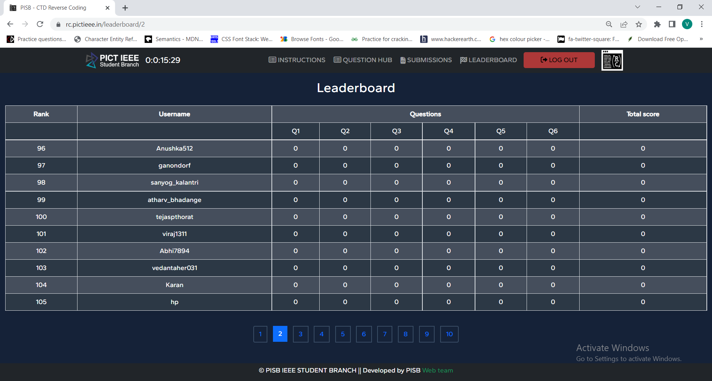

# Event Screenshots

# Getting Started with the Project

git clone link

## Install React Scripts

npm install 

### `npm start`
npm start
Open [http://localhost:3000](http://localhost:3000) to view it in your browser.